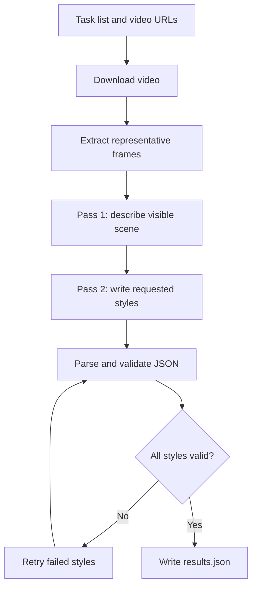

# Tetrlense AI — Four Voices, One Vision

A **style-conditioned video captioning prototype** built for the AMD Developer Hackathon: ACT II (Track 2). It uses a two-pass vision-language workflow to generate captions in multiple styles while keeping factual scene understanding separate from creative wording.

- **Developer:** Alagappan
- **Team:** VectorForge AI
- **Core workflow:** scene understanding → style-conditioned caption generation
- **Model provider:** Fireworks AI (model IDs are configurable)

## New here? Start with the learning guides

- **[Beginner guide: understand and run the project](docs/START_HERE.md)** — setup, plain-English vocabulary, code map, troubleshooting, and a learning plan.
- **[Interview notes](docs/INTERVIEW_NOTES.md)** — concise project explanation, design trade-offs, and practice questions.

## The problem

A caption can sound polished while describing something that never happened in the video. This project experiments with separating the factual description of a clip from the later task of writing in a particular voice.

## How it works



### Key engineering decisions

- **Two-pass generation:** first create a factual grounding description, then use it as context for styled captions. This is intended to reduce unsupported details; it does not eliminate hallucinations.
- **Scene-aware frame extraction:** FFmpeg scene detection is attempted first, with uniform sampling as a fallback when the selected frames are unsuitable.
- **Targeted retries:** retry an individual style if its output cannot be parsed, instead of rerunning every style.
- **Concurrent processing:** a bounded thread pool processes multiple clips concurrently.
- **Defensive output parsing:** handles common formatting problems such as Markdown fences and surrounding text, with fallback parsing for imperfect model output.

## Tech stack

Python · FFmpeg · Fireworks AI API · Docker · Streamlit

## Quick start

### Requirements

- Python 3.11 (the version used by CI)
- FFmpeg installed and available on your PATH
- A Fireworks AI API key

Install dependencies:

```bash
python -m venv .venv
# macOS/Linux
source .venv/bin/activate
# Windows PowerShell: .venv\\Scripts\\Activate.ps1
python -m pip install -r requirements.txt
```

Set the API key and input/output paths, then run:

```bash
export FIREWORKS_API_KEY=your_key_here
export TASKS_PATH=./test_input/TASKS.json
export RESULTS_PATH=./test_output/results.json
python app.py
```

On Windows PowerShell, use `$env:FIREWORKS_API_KEY="your_key_here"` and equivalent `$env:TASKS_PATH` / `$env:RESULTS_PATH` assignments instead of `export`.

Inspect the generated `results.json` and verify that each task has the expected styles. Make sure the output directory exists if required by your local run.

### Run the interactive dashboard

```bash
python -m pip install -r requirements_demo.txt
streamlit run demo_app.py
``

### Run with Docker

Build:

```bash
docker buildx build --platform linux/amd64 -t video-captioning-agent:latest --load .
```

Run (mount local input and output directories):

```bash
docker run --rm \
  -e FIREWORKS_API_KEY \
  -v "$(pwd)/test_input:/input" \
  -v "$(pwd)/test_output:/output" \
  video-captioning-agent:latest
```

## Configuration

| Variable | Purpose |
|---|---|
| `FIREWORKS_API_KEY` | Required provider authentication |
| `FIREWORKS_BASE_URL` | API endpoint override |
| `FIREWORKS_VISION_MODEL` | Vision model ID override |
| `FIREWORKS_TEXT_MODEL` | Text/style model ID override |
| `TASKS_PATH` | Input task file |
| `RESULTS_PATH` | Output JSON file |
| `NUM_FRAMES` | Target number of frames sampled |
| `MAX_FRAME_DIM` | Maximum frame dimension |
| `TWO_PASS` | Set to `0` to disable the two-pass flow |

The code is the source of truth for defaults; model identifiers and defaults may evolve.

## Limitations and next steps

- Caption quality depends on the selected model and sampled frames; events between sampled frames can be missed.
- A grounding description can itself be wrong, and the second pass can introduce details not present in the video.
- The evaluation script uses an LLM judge, which can be inconsistent; its scores are not objective ground truth.
- Provider latency, rate limits, and API costs affect throughput.
- Useful next improvements include a repeatable human-reviewed evaluation set, tests for malformed model responses, measurements for latency/cost, and clearer failure reporting for failed downloads or clips.

## Project structure

```text
app.py                 # Main captioning pipeline
demo_app.py            # Interactive Streamlit demo
evaluate.py             # LLM-as-judge evaluation
requirements.txt        # Batch dependencies
requirements_demo.txt   # Demo UI dependencies
Dockerfile              # Container image
test_input/TASKS.json   # Example input tasks
docs/START_HERE.md      # Beginner-friendly learning guide
docs/INTERVIEW_NOTES.md # Interview preparation
.github/workflows/      # Automated checks
```

## About

Built by Alagappan as a hackathon project exploring multimodal AI pipelines, structured model outputs, retries, and containerized execution. This is a prototype, not a claim of production-grade video understanding.
